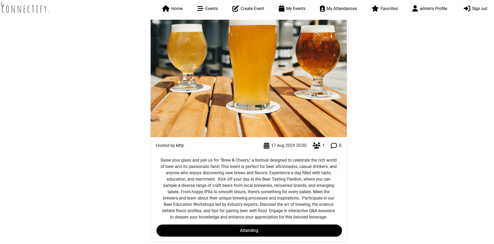
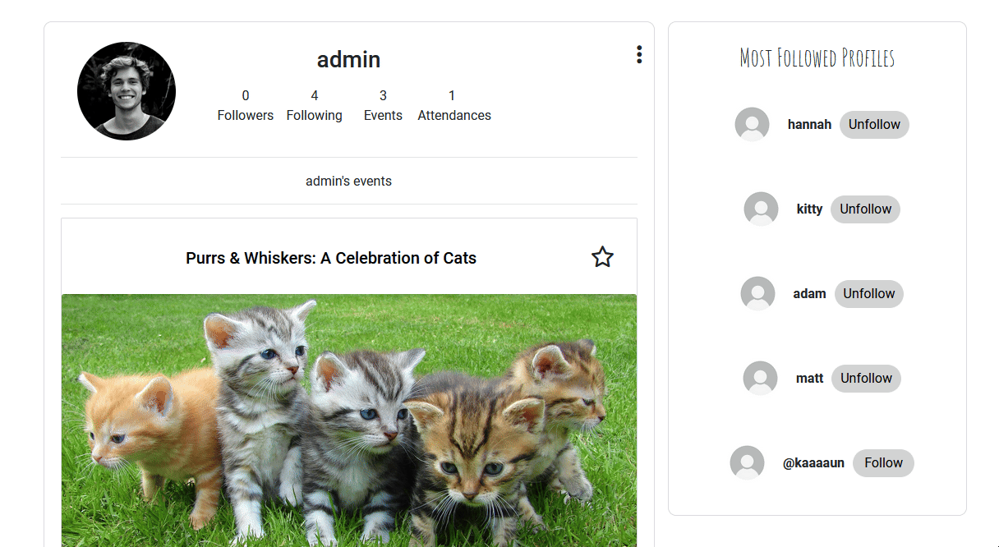

# connectify.

connectify. is a social media platform for hosting and organizing in-person and virtual activities, gatherings, and events for people and communities of similar interests, hobbies, and professions.

Visit the deployed website here → [connectify.](https://connectify-frontend-6f920dea36d9.herokuapp.com/) 
Visit the API repository here → [API](https://github.com/enniovilla/project-5-backend) 
The User Stories you can see here → [GitHub Project](https://github.com/users/enniovilla/projects/10)

## Content

* [User Experience](#user-experience-ux)
    * [Site Objectives](#site-objectives)
    * [User Stories](#user-stories)
* [Design](#design)
    * [Website Structure](#website-structure)
    * [Wireframes](#wireframes)
    * [Color Scheme](#color-scheme)
    * [Typography](#typography)
* [Features and Future Features](#features-and-future-features)
    * [Features](#features)
    * [Future Features](#future-features)
* [Technologies Used](#technologies-used)
* [Deployment, Fork and Clone](#deployment-fork-and-clone)
    * [Deployment](#deployment)
    * [Fork](#how-to-fork)
    * [Clone](#how-to-clone)
* [Testing](#testing)
* [Bugs](#bugs)
    * [Known Bugs](#known-bugs)
* [Credits](#credits)
* [Content](#content)
* [Acknowledgments](#acknowledgments)

## User Experience (UX)

User Experience (UX) focuses on how users interact with and experience a website. For a site like connectify., which connects people with common interests, UX involves making the process of finding and joining events smooth, intuitive, and enjoyable.

### Site Objectives

Defining the site objectives involves understanding what the website aims to achieve. Objectives might include:

* Connect Users: Facilitate connections between users with similar interests.
* Event Management: Allow users to create, manage, and RSVP to events.
* Community Building: Foster a sense of community among users.
* Engagement: Encourage regular interaction and participation.

### User Stories

#### First Time User

A first-time user is someone visiting the site for the first time. Their story might involve:

* Onboarding: Discovering what the site is about, how to sign up, and what benefits it offers.
* Exploration: Browsing available events to understand what’s available.
* Registration: Creating an account and setting up a profile.
* Initial Engagement: Finding and joining a first event.

#### Returning User

A returning user is someone who has visited the site before but isn't necessarily a frequent user. Their story might involve:

* Re-engagement: Logging in to see new events or updates from previously joined events.
* Profile Management: Updating personal information or preferences.
* Event Participation: RSVPing to upcoming events or managing existing event participation.

#### Frequent User

A frequent user regularly interacts with the site. Their story might involve:

* Active Participation: Regularly creating, managing, and attending events.
* Community Interaction: Engaging with other users through comments.

[Back to top](<#content>)

## Design

### Website Structure

I had several plans for this project, but none of the ideas I had gave me the confidence to follow through, so I decided to do the simple thing and decided to create a website similar to the Walkthrough Moments website, the difference being that the users of my site will be engaged by events and not by sharing images.

### Wireframes

Figma was the software I opted to create the wireframes. I created wireframes for mobile and desktop. Click on the button below to see them.

Wireframes

  
Home page 

  
Events Feed 

  
Create Event 

  
Profile Page 

  
Sign In/Up 
 

 

[Back to top](<#content>)

### Color Scheme

I chose to create a simple, minimalist website with the main colors being black (`#000`) and white (`#FFF`) and a few shades of gray.

Some other singular colors also appear in the project, such as the colors of the standard Bootstrap buttons.

[Back to top](<#content>)

### Typography

I chose the font [Amatic SC](https://fonts.google.com/specimen/Amatic+SC) for some of the headers. For everything else I chose [Roboto](https://fonts.google.com/specimen/Roboto) from Google Fonts and as a fall back font, sans-serif.

[Back to top](<#content>)

## Features and Future Features

### Features

This is a multi-page website. On each page we have:

- A favicon.

- A navigation bar with clickable logo and links that change if the user is logged in or not.

[Back to top](<#content>)

### The Home Page

On the home page the user can see a welcome message and the navigation bar.

[Back to top](<#content>)

### The Sign Up Page

The user needs to provide a username and password to register, and confirm this password to reinforce security.

[Back to top](<#content>)

### The Sign In Page
 Page

With correct username and password, the user can access their profile.

[Back to top](<#content>)

### The Events Feed

The events feed is the main page of the website, where the user can see all the events offered by other users. This page has infinite scroll.

[Back to top](<#content>)

### The Create Event Form

Here the user needs to provide a title, description, date, time and image to create an event.

[Back to top](<#content>)

### The Event Card

The event card contains a star icon for the user to favorite, the event host's name, the date, the time, the number of participants, the number of comments, the description, the title, and the RSVP button.

[Back to top](<#content>)

### The My Events Page

On this page the user can see events created by them, making it easier and faster the management of their own events.

[Back to top](<#content>)

### The My Attendances Page

Unlike the my events page, here the user can only see the events they have marked as attending.

[Back to top](<#content>)

### Favorites Page

This page is reserved for events that the user has favorited because they are interested but do not yet know if they will be able to attend the event.

[Back to top](<#content>)

### My Profile

Account user profile page. If you are the user of the account, you can see the button to follow other users. If it's a visitor to your page, they can see the events you've created below your profile, as well as how many people you follow, who follows you, how many events you've attended, your bio and photo.

[Back to top](<#content>)

### Follow Users

Users can follow and be followed.

[Back to top](<#content>)

### Edit Profile Menu

As an user you can edit some information about your account.

[Back to top](<#content>)

### Edit Profile Page

Here the user can change the profile picture and add a bio.

[Back to top](<#content>)

### Change Username Page

The user can change the username on this page.

[Back to top](<#content>)

### Change Password Page

The user can change the password on this page.

[Back to top](<#content>)

### Sign Out Modal

When the user wants to log out of their account, they will receive an on-screen message after pressing the log out button, confirming that they really want to do so.

[Back to top](<#content>)

### Delete Event Modal

If the user wants to delete an event they created, they will receive a confirmation modal.

[Back to top](<#content>)

### Future Features

This project is so complex and large that it can be improved by more than 100%, but I would like to:
- Add a messaging system between users
- Integrate a Google Maps API to show event location
- Implement a notification system on the website/app
- Create groups
- Add hashtags to events

[Back to top](<#content>)

## Technologies Used

- HTML5 to create the website structure.
- CSS3 to style the website.
- JavaScript to create the interactions on the website.
- [React-Bootstrap](https://react-bootstrap.netlify.app/) to give responsiveness and style to the project.
- [Git](https://git-scm.com/) for version control.
- [GitPod](https://www.gitpod.io/) as IDE to create the website.
- [GitHub](https://github.com/) to store files for the website.
- [Figma](https://www.figma.com/) to create the wireframes.
- [Chat GPT](https://chat.openai.com/) to generate fictional texts.
- [Google Fonts](https://fonts.google.com/) to import the font used on the website.
- [Logo](https://favicon.io/) to create favicon.
- [Am I Responsive?](https://ui.dev/amiresponsive) to display the website image across various devices.
- [PostgreSQL](https://www.postgresql.org/) through Code Institute databases.
- [Heroku](https://www.heroku.com/) to deploy this project.
- [Cloudinary](https://cloudinary.com/) to store the images uploaded on the website.

[Back to top](<#content>)

## Deployment, Fork and Clone

### Deployment

The application has been deployed from GitHub to Heroku by following the steps:

1. Create or log in to your account at [Heroku](https://www.heroku.com/).
2. Create a new app, add a unique app name and then choose your region.
3. Click on Create App.
4. Go to "Settings".
5. Under Config Vars add a key "PORT" and value "8000".
6. Add required buildpacks (further dependencies). For this project, set it up so Python will be on top and Node.js on bottom.
7. Go to "Deploy" and select "GitHub" in "Deployment method".
8. To connect Heroku app to your Github repository code enter your repository name, click "Search" and then "Search" when it shows below.
9. Choose the branch you want to build your app from.
10. If preferred, click on "Enable Automatic Deploys", which keeps the app up to date with your GitHub repository.
11. Wait for the app to build. Once ready you will see the “App was successfully deployed” message and a "View" button to take you to your deployed link.

[Back to top](<#content>)

### How to Fork

1. Log in to GitHub.
2. Go to the repository for the project.
3. Click the Fork button in the top right corner.

### How to Clone

1. Log in to GitHub.
2. Go to the repository for the project.
3. Click on the **green code button** and select if you would like to clone with HTTPS, SSH or GitHub CLI and copy the link below.
4. Navigate to the directory where you want to clone the repository and open terminal.
5. Type *git clone* into the terminal and paste the link you have from number 3. Press enter. This command will download the entire repository to your local machine.

[Back to top](<#content>)

## Testing

Performed tests can be found in [TESTING.md](TESTING.md).

[Back to top](<#content>)

## Bugs

### Known Bugs

- I couldn't test my website on Google Chrome on my computer. I don't know what's happening, but I'm not allowed to stay logged in. However, it works on Google Chrome on my mobile, and on one occasion when I needed tutor support, it worked fine on the tutor's computer as well. So, I believe the problem is with my Google Chrome. The website worked responsively with all functionalities on any other browser.

[Back to top](<#content>)

## Credits

- All the features of my website were developed with the guidance of the lessons from the Code Institute's Moments project.

## Content

- The default profile and default event images were provided by Code Institute in the Django Rest Framework walkthrough project and I reused them.
- The other images on the website were downloaded from [Pexels](https://www.pexels.com/).

## Acknowledgments

I would like to acknowledge:
- Kay Welfare - My cohort facilitator who's always there for us.
- Jubril Akolade - My Code Institute mentor for understanding my struggles and always giving me nice suggestions.
- My friends who are supporting me and understand if I can't hang out with them because I need to finish my project.

[Back to top](<#content>)